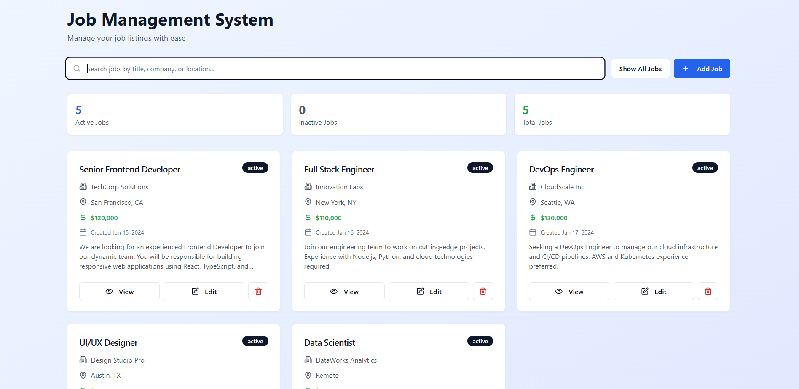
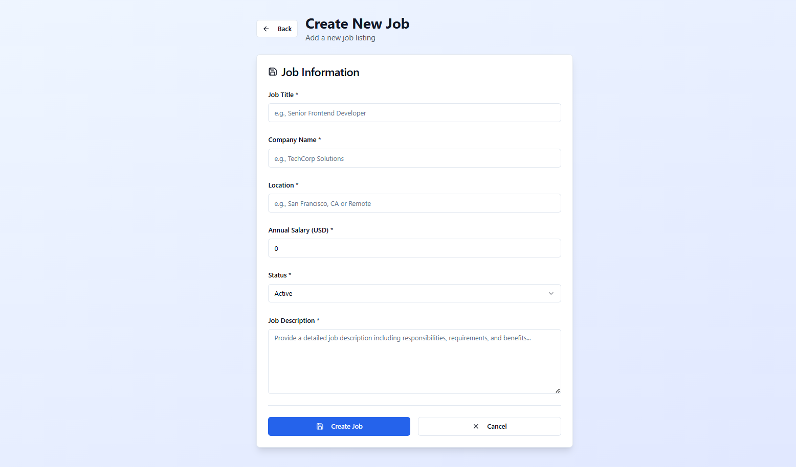
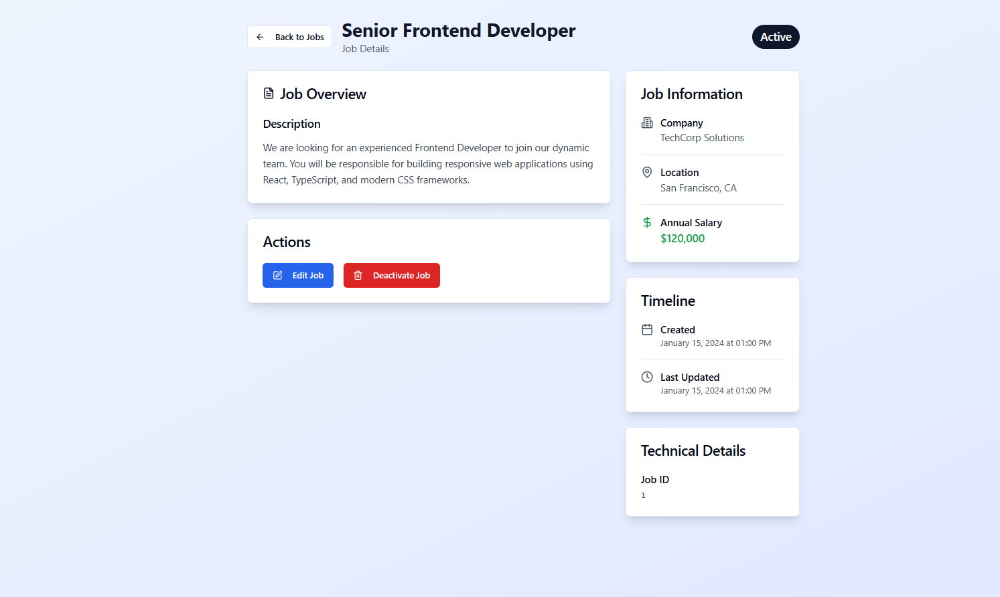

# Job Management System

Welcome to the Job Management System! This is a full-stack web application designed to streamline the process of managing job listings. Users can effortlessly create, view, update, and soft-delete job postings, providing a clean and efficient platform for job management.

---

## 🗒️ Table of Contents

* [🎯 Objective](#-objective)
* [🛠️ Features](#️-features)
    * [Backend (Django + Django REST Framework)](#backend-django--django-rest-framework)
    * [Frontend (React + Tailwind CSS)](#frontend-react--tailwind-css)
* [📂 Project Structure](#-project-structure)
* [🚀 Getting Started](#-getting-started)
    * [Prerequisites](#prerequisites)
    * [Backend Setup](#backend-setup)
    * [Frontend Setup](#frontend-setup)
* [⚙️ API Endpoints](#️-api-endpoints)
* [🧪 Test Data](#-test-data)
* [📸 Screenshots](#-screenshots)
* [🌟 Bonus Features (Optional)](#-bonus-features-optional)
* [📞 Contact ](#-contact)

---

## 🎯 Objective

This project aims to build a robust and intuitive RESTful Job Management System utilizing a modern tech stack:

* **Backend:** Django with Django REST Framework
* **Database:** PostgreSQL
* **Frontend:** React with Tailwind CSS
* **API Communication:** Rest API using Aios
* **Version Control:** Git & GitHub

---

## 🛠️ Features

### Backend (Django + Django REST Framework)

The Django backend provides a powerful REST API for all job-related operations.

* **Full CRUD Functionality:** Complete Create, Read, Update, and Delete operations for job listings.
* **Soft Delete:** Jobs are "soft-deleted" by updating their `status` field to "inactive" instead of permanent removal.
* **JSON API:** All API endpoints return data in JSON format.
* **PostgreSQL Integration:** Utilizes PostgreSQL as the primary database for reliable data storage.

**Job Fields:**

* `title` (string): Job title.
* `description` (long text): Full job description.
* `company_name` (string): Name of the hiring company.
* `location` (string): Job location.
* `salary` (integer): Monthly or annual salary.
* `status` (string): Indicates job status ("active" or "inactive").
* `created_at` (auto timestamp): Automatically recorded creation timestamp.
* `updated_at` (auto timestamp): Automatically updated modification timestamp.

---

### Frontend (React + Tailwind CSS)

The React frontend offers a responsive and user-friendly interface for interacting with the job data.

* **Homepage:** A main view that lists all **active** job listings.
* **Job Posting Form:** A dedicated form to create new job listings.
* **Edit Form:** An interface to update existing job details.
* **Job Detail View:** A comprehensive view displaying all information for a single job.
* **Soft Delete Button:** A button on each job listing to easily deactivate it.
* **UI/UX:**
    * Job listings are displayed in an intuitive card layout.
    * Visual indicators help quickly identify job status.
    * Tailwind CSS ensures a consistent, modern, and responsive design.
    * Success messages provide immediate feedback after create, update, or delete actions.
* **API Communication:** Uses **Axios** for seamless interaction with the Django backend API.

---

## 📂 Project Structure

The repository is organized into two main directories: `backend` for the Django API and `frontend` for the React application.
```
job-management-system/
├── backend/
│   ├── job_management_backend/  # Main Django project settings
│   │   ├── init.py
│   │   ├── asgi.py
│   │   ├── settings.py          # Database, CORS, installed apps config
│   │   ├── urls.py              # Main URL dispatcher
│   │   └── wsgi.py
│   ├── jobs/                    # Django app for job listings
│   │   ├── migrations/
│   │   ├── management/
│   │   │   └── commands/
│   │   │       └── populate_jobs.py # Script for test data
│   │   ├── init.py
│   │   ├── admin.py
│   │   ├── apps.py
│   │   ├── models.py            # Job model definition
│   │   ├── serializers.py       # DRF serializers for Job model
│   │   ├── urls.py              # App-specific URL patterns
│   │   └── views.py             # DRF API views
│   ├── manage.py                # Django management script
│   └── requirements.txt         # Python dependencies
│
├── frontend/
│   ├── public/                  # Public assets
│   ├── src/
│   │   ├── App.jsx              # Main React app component & router
│   │   ├── main.jsx             # Entry point (for Vite)
│   │   ├── index.css            # Global CSS, including Tailwind directives
│   │   ├── components/
│   │   │   ├── ui/      
│   │   │   ├── JobForm.jsx      # Reusable form for create/edit
│   │   │   └── JobDetail.jsx    # Displays  job details
│   │   ├── hooks/
│   │   ├── pages/       
│   │   │   ├── Index.jsx       # hadnle backend
│   │   └── services/
│   │       └── jobService.js    # Centralized Axios API calls
│   ├── index.html               # HTML entry point
│   ├── package.json             # Node.js project metadata & dependencies
│   ├── tailwind.config.js       # Tailwind CSS configuration
│   └── vite.config.js           # Vite configuration (or other bundler config)
├── screenshots/
└── README.md                    
```

---

## 🚀 Getting Started

Follow these instructions to set up and run the project on your local machine.

### Prerequisites

Ensure you have the following installed:

* **Python 3.8+**
* **Node.js 14+** & **npm 6+** (or Yarn)
* **PostgreSQL** database server

### Backend Setup

1.  **Clone the repository:**
    ```bash
    git clone https://github.com/derksKCodes/job-listing-management-system.git
    cd job-management-system/backend
    ```

2.  **Create and activate a Python virtual environment:**

    ```bash
    python -m venv venv
    source venv/bin/activate  # On Windows: .\venv\Scripts\activate
    ```

3.  **Install Python dependencies:**

    ```bash
    pip install -r requirements.txt
    ```

4.  **Configure PostgreSQL:**

    * Create a PostgreSQL database (e.g., `job_management_db`).
    * Update `backend/job_management_backend/settings.py` with your PostgreSQL database credentials:
        ```python
        DATABASES = {
            'default': {
                'ENGINE': 'django.db.backends.postgresql',
                'NAME': 'job_management_db',
                'USER': 'your_postgres_user',
                'PASSWORD': 'your_postgres_password',
                'HOST': 'localhost', # Or your database host
                'PORT': '5432',
            }
        }
        CORS_ALLOWED_ORIGINS = [
            "http://localhost:8080", # Or the port your React app runs on
        ]
        ```

5.  **Run database migrations:**

    ```bash
    python manage.py makemigrations jobs
    python manage.py migrate
    ```

6.  **(Optional) Create a Django superuser** for admin panel access:

    ```bash
    python manage.py createsuperuser
    ```

7.  **Run the Django development server:**

    ```bash
    python manage.py runserver
    ```
    The backend API will be running at `http://localhost:8000`.

### Frontend Setup

1.  **Navigate to the frontend directory:**

    ```bash
    cd ../frontend
    ```

2.  **Install Node.js dependencies:**

    ```bash
    npm install
    # or
    yarn install
    ```

3.  **Run the React development server:**

    ```bash
    npm run dev
    # or
    yarn dev
    ```
    The frontend application will typically open in your browser at `http://localhost:8080`.

---

## ⚙️ API Endpoints

The following API endpoints are available from the Django backend:

| Method | Endpoint                     | Description                                  |
| :----- | :--------------------------- | :------------------------------------------- |
| `POST` | `/api/jobs/`                 | Create a new job listing                     |
| `GET`  | `/api/jobs/`                 | List all **active** job listings             |
| `GET`  | `/api/jobs/<id>/`            | Retrieve details of a single job             |
| `PUT`  | `/api/jobs/<id>/`            | Update an existing job listing               |
| `PATCH`| `/api/jobs/<id>/deactivate/` | Soft-delete (set status to "inactive") a job |

---

## 🧪 Test Data

To quickly populate your database with sample job listings for testing and demo purposes, you can use a custom Django management command:

1.  Ensure your backend server is **not** running.
2.  Navigate to the `backend` directory in your terminal.
3.  Run the command:

    ```bash
    python manage.py populate_jobs
    ```
    This will delete any existing jobs and add at least 5 sample job listings, including one inactive job for demonstration.

---

## 📸 Screenshots


### Homepage (Active Job Listings)

*A snapshot of the main job listings page, displaying various active jobs in a card layout.*

### Create New Job

*The form used to post a new job listing.*

### Job Details View

*A detailed view of a single job, showing all its attributes.*

---

## 🌟 Bonus Features (Optional)

The following features were considered for enhancement and could be implemented to expand the application's functionality:

* **Filtering:** Filter job listings by location or company name.
* **Pagination:** Implement pagination for the job list view to handle large datasets efficiently.
* **Search Bar:** Add a search bar to quickly find jobs by title or company name.
* **Form Validation:** Enhance client-side form validation for a smoother user experience, providing real-time feedback to users.

---

## 📞 Contact

### Get in Touch

**Derrick** - Software Developer

- 📧 **Email**: [derikkaraja001@gmail.com](mailto:derikkaraja001@gmail.com)
- 💼 **LinkedIn**: [linkedin.com/in/derks01](https://linkedin.com/in/derks01)
- 🐱 **GitHub**: [github.com/derksKCodes](https://github.com/derksKCodes)
- 🌐 **My Portfolio**: [My Portfolio](https://my-portfolio-project-dk-jr.vercel.app/)

### Project Links

- 🌐 **Live Demo**: [job-listing-management-system.vercel.app/](https://job-listing-management-system.vercel.app/)
- 📁 **Repository**: [github.com/derksKCodes/job-listing-management-system](https://github.com/derksKCodes/job-listing-management-system)

---

<div align="center">

**⭐ Star this repository if you found it helpful!**

Made with ❤️ by  [Derrick](https://my-portfolio-project-dk-jr.vercel.app/)

</div>
